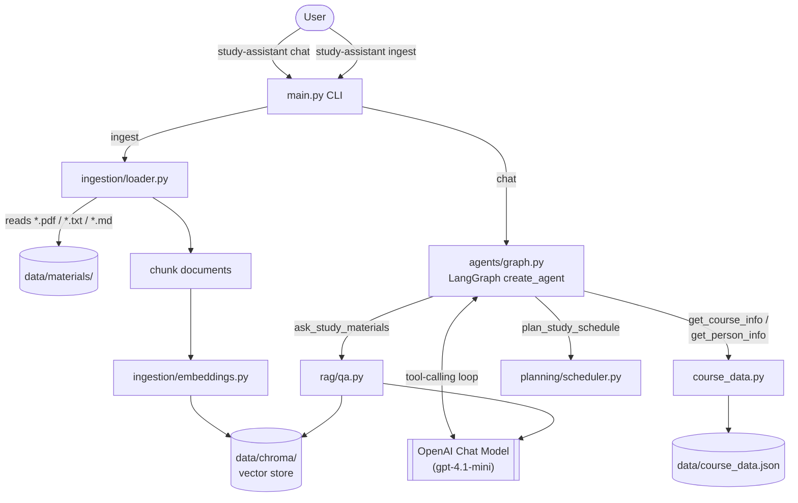

# Architecture

This document explains how the Personal AI Study Workflow Assistant works end to end:
what happens when you run each command, how the pieces fit together, and why a few
things are built the way they are.

For setup/usage instructions, see [README.md](README.md).

## What it is

A command-line agent, built as a [LangGraph](https://github.com/langchain-ai/langgraph)
tool-calling agent on top of OpenAI models, that helps you:

- **Ask questions about your own study materials** (PDFs, notes) — a retrieval-augmented
  generation (RAG) pipeline grounds answers in content you've ingested.
- **Look up course/roster info** (assignments, grading breakdown, students, teachers) —
  served from a structured JSON file via dedicated tools, not RAG.
- **Build a study schedule** — a deterministic greedy scheduler, no LLM involved.

The agent itself doesn't hard-code any of this logic; it's given a system prompt and a
list of tools, and it decides at each turn whether to answer directly or call a tool.

## High-level diagram



## Components

| Module | Responsibility |
|---|---|
| [`main.py`](src/study_assistant/main.py) | `argparse` CLI: `ingest`, `chat`, and a global `--debug` flag. Thin — just wires args to the functions below. |
| [`config.py`](src/study_assistant/config.py) | Loads `.env` and exposes a single `settings` object (API key, model names, file paths). Everything else reads config from here, never from `os.environ` directly. |
| [`ingestion/loader.py`](src/study_assistant/ingestion/loader.py) | Walks `data/materials/`, loads `.pdf`/`.txt`/`.md` files, splits them into chunks (`RecursiveCharacterTextSplitter`). |
| [`ingestion/embeddings.py`](src/study_assistant/ingestion/embeddings.py) | Builds the `OpenAIEmbeddings` client used to embed both ingested chunks and incoming questions. |
| [`ingestion/vectorstore.py`](src/study_assistant/ingestion/vectorstore.py) | Wraps a local `Chroma` collection persisted at `data/chroma/`; `index_documents` adds embedded chunks to it. |
| [`rag/qa.py`](src/study_assistant/rag/qa.py) | Given a question: similarity-search the vector store for top-`k` chunks, stuff them into a prompt, ask the chat model, return the answer. |
| [`course_data.py`](src/study_assistant/course_data.py) | Loads `data/course_data.json` (course name/term, assignments, grading breakdown, student/teacher roster) and exposes lookup functions. See [Why course data isn't RAG-ingested](#why-course-data-isnt-rag-ingested) below. |
| [`course_progress.py`](src/study_assistant/course_progress.py) | Tracks which assignments the user has marked completed, persisted to `data/course_progress.json`. Backs the `whats_next` tool. |
| [`planning/models.py`](src/study_assistant/planning/models.py) | Pydantic models: `StudyTask` (input) and `StudyBlock` (a scheduled chunk of work). |
| [`planning/scheduler.py`](src/study_assistant/planning/scheduler.py) | Pure, deterministic greedy algorithm — no LLM call. Allocates daily hours to tasks, nearest deadline first, ties broken by priority. |
| [`agents/tools.py`](src/study_assistant/agents/tools.py) | Wraps the functions above as LangChain `@tool`s: `ask_study_materials`, `plan_study_schedule`, `get_course_info`, `get_person_info`. |
| [`agents/graph.py`](src/study_assistant/agents/graph.py) | Builds the agent: `ChatOpenAI` + the tool list + a system prompt, via LangChain's `create_agent` (a prebuilt LangGraph ReAct-style tool-calling loop). |
| [`gui.py`](src/study_assistant/gui.py) | Optional Gradio chat UI (`study-assistant gui`, needs the `gui` extra). See [GUI](#gui) below. |

## GUI

`study-assistant gui` launches a Gradio app with a chat pane and two live tabs:

- **Trace** — built by calling `agent.stream(..., stream_mode="values")` instead of
  `.invoke()`. LangGraph yields the full message list after every step, so diffing
  consecutive yields exposes each `AIMessage` tool call and matching `ToolMessage` result
  as they happen, not just the final answer.
- **Log** — tails `data/guardrail_events.log`, the same file `observability.py` writes to
  for the CLI. Independent of `--debug`, which is far noisier (raw HTTP + full LangChain
  trace) and not meant for this kind of at-a-glance view.

Conversation history is threaded across turns via a `gr.State` holding the LangChain
message list (not just chat display text), so follow-up questions ("how many points is
it worth?") resolve correctly against prior turns — the CLI's `cmd_chat`, by contrast,
sends only the latest message each turn and has no cross-turn memory.

This was adapted from a different project's Gradio demo
(`Module5/Local-Agent-Demo`), which is built on a from-scratch Ollama+MCP agent loop with
no LangChain involved at all. Only the UI shape (chat + live side panels) carried over;
the event-handling logic here is written from scratch against this project's LangGraph
agent and tools. That demo's Context/Memory/Tools panels weren't ported, since they map to
concepts (windowed short-term memory, MCP tool discovery, a separate long-term memory
store) that don't exist in this project's architecture — Trace and Log are what's
actually meaningful here.

## Two commands, two flows

### `study-assistant ingest`

```
load_documents(data/materials/) → split_documents() → get_embeddings() → index_documents()
```

One-shot, no LLM chat call. Reads whatever files are currently in `data/materials/`,
chunks them, embeds them, and writes/updates the persisted Chroma collection at
`data/chroma/`. Re-running it re-embeds and appends — it does not currently de-duplicate
against a previous run.

### `study-assistant chat`

```
input("> ") → agent.invoke({"messages": [...]}) → print(result)
```

Each turn goes through LangGraph's tool-calling loop:

1. The full conversation (system prompt + message history) goes to the chat model.
2. The model either answers directly, or emits one or more tool calls.
3. If it calls a tool, the corresponding Python function in `tools.py` runs and its
   return value (a string) is appended to the conversation as a tool message.
4. The model is called again with that tool result in context, and either answers or
   calls another tool.
5. The final assistant message is printed.

Run with `--debug` to see this loop directly — it turns on LangChain's `set_debug(True)`,
which prints every chain/LLM/tool step, plus raw HTTP-level logging for the OpenAI calls.

## The four tools

| Tool | Backed by | Uses the LLM? |
|---|---|---|
| `ask_study_materials` | Chroma similarity search over `data/materials/` | Yes — to compose the final answer from retrieved chunks |
| `get_course_info` | `data/course_data.json` (course, term, assignments) | No — pure lookup |
| `get_person_info` | `data/course_data.json` (students, teachers) | No — pure lookup, case-insensitive name match |
| `plan_study_schedule` | `planning/scheduler.py` greedy algorithm | No — deterministic |

Only `ask_study_materials` involves retrieval + generation. The other three are plain
function calls — the LLM's job there is purely deciding *when* to call them and how to
phrase the arguments (e.g. parsing "how am I doing" into a call to `get_person_info`).

## Why course data isn't RAG-ingested

`data/course_data.json` deliberately lives outside `data/materials/` and is never
chunked/embedded. It's read on demand by `get_course_info`/`get_person_info` at tool-call
time. This matters for two reasons:

- **Freshness** — a JSON file read on every call always reflects the current file
  contents; RAG-ingested content is a stale snapshot from whenever you last ran `ingest`.
- **Structure** — this is small, structured, per-record data (a roster, a grading table).
  Answering "what's Alex Chen's background?" by exact key lookup is more reliable than
  hoping the right chunk gets retrieved by similarity search.

## Configuration

All settings live in `.env` (copy from `.env.example`) and are loaded once in
[`config.py`](src/study_assistant/config.py):

| Variable | Default | Purpose |
|---|---|---|
| `OPENAI_API_KEY` | — | required; used for both chat and embedding calls |
| `STUDY_ASSISTANT_MODEL` | `gpt-4.1-mini` | chat model for the agent and RAG answers |
| `STUDY_ASSISTANT_EMBEDDING_MODEL` | `text-embedding-3-small` | embedding model for ingestion and query embedding |
| `STUDY_MATERIALS_DIR` | `data/materials` | where `ingest` looks for source documents |
| `CHROMA_PERSIST_DIR` | `data/chroma` | where the vector store is persisted |
| `COURSE_DATA_PATH` | `data/course_data.json` | source for `get_course_info`/`get_person_info` |

## What's checked into git vs. generated locally

- `data/materials/*` and `data/chroma/` are gitignored — they're your personal study
  content and the derived vector index, regenerated locally via `ingest`.
- `data/course_data.json` is *not* gitignored (only `.gitkeep` under `data/materials/`
  is tracked today) — it's small structured sample/course data rather than a personal
  document dump.

## Tech stack

- **LangGraph / LangChain `create_agent`** — the tool-calling agent loop
- **OpenAI** — chat completions (`gpt-4.1-mini`) and embeddings (`text-embedding-3-small`)
- **Chroma** — local, file-persisted vector store
- **Pydantic** — validates tool arguments (`StudyTask`) and planning data models
- **argparse** — CLI parsing, no external CLI framework

## Safety guardrails

Implements the guardrails from the Capstone Checkpoint 6.1 Safety Guardrails and Human
Intervention Plan:

| Guardrail | Where | Behavior |
|---|---|---|
| Input validation | [`main.py`](src/study_assistant/main.py) `cmd_chat` | Empty/whitespace-only input is skipped rather than sent to the agent. |
| Evidence grounding | [`rag/qa.py`](src/study_assistant/rag/qa.py) | If retrieval returns zero chunks, the tool returns a fixed "no materials ingested" message and never calls the LLM — it can't invent an answer with no evidence. |
| Confidence-based escalation | [`rag/qa.py`](src/study_assistant/rag/qa.py) | The best retrieval distance is compared to `RAG_MAX_DISTANCE` (default `1.3`). Above it, the prompt tells the model confidence is `'low'` and to make clear the answer needs verification, instead of answering with false confidence. |
| Restricted tool access | [`agents/tools.py`](src/study_assistant/agents/tools.py), [`agents/graph.py`](src/study_assistant/agents/graph.py) | There are no tools to submit assignments, modify records, or send messages — only retrieval, lookup, and scheduling. The system prompt states this explicitly so the model doesn't attempt it. |
| Runtime/audit logging | [`observability.py`](src/study_assistant/observability.py) | An always-on (independent of `--debug`) logger writes retrieval confidence, escalation events, and unhandled errors to `GUARDRAIL_LOG_PATH` (default `data/guardrail_events.log`) — distinct from `--debug`'s verbose LangChain trace, meant for reviewing agent behavior over time. |
| Graceful error handling | [`main.py`](src/study_assistant/main.py) `cmd_chat` | An exception during `agent.invoke` is logged and the user gets a plain-language message, instead of a raw traceback killing the chat loop. |

Not implemented: automatic scope classification (rejecting off-topic requests before
they reach the agent) — currently the system prompt is the only scope control, which is
a soft measure, not a hard guardrail.

## "What's next" (Capstone Checkpoint 2.1)

Checkpoint 2.1's design doc narrows the project to answering one question reliably:
*"What should I work on next for my course?"* Two tools implement this directly:

- **`whats_next`** — reads assignments from `course_data.py`, excludes anything in
  `course_progress.py`'s completed set, parses `due_date` (`%d-%b-%y`), and returns the
  nearest-due pending item.
- **`mark_assignment_completed`** — case-insensitive partial-name match against known
  assignments, persists the canonical name to `data/course_progress.json`.

Deliberately out of scope from that same doc: a generic long-term memory tool
(`project_memory.json`/`prior_feedback.json`) and a reminder tool — both are real gaps,
but weren't added here since they weren't clearly CMU-course-scoped requests on their
own; add them as a separate, explicit ask if needed.

## Checkpoint-aware retrieval + MMR (Capstone Checkpoint 3.1)

Checkpoint 3.1's design doc calls out a specific retrieval failure mode: asking about one
checkpoint could retrieve another's content, since files about similar topics (e.g.
several capstone checkpoints) can be semantically close together. It also proposes MMR to
avoid several near-duplicate chunks crowding out distinct information. Both are
implemented in [`rag/qa.py`](src/study_assistant/rag/qa.py):

- **Metadata tagging** — [`loader.py`](src/study_assistant/ingestion/loader.py) tags each
  chunk with `checkpoint` (parsed from the filename, e.g. `"3.1"`) and `doc_type`
  (`assignment_brief` / `design_submission` / `reference`) at ingestion time.
- **Checkpoint-scoped retrieval** — if the question names a checkpoint/assignment number
  (`"checkpoint 3.1"`, case-insensitive), retrieval is first tried filtered to
  `{"checkpoint": "3.1"}`. If that filter returns anything, it's used exclusively; if not
  (e.g. the number doesn't match anything ingested), it falls back to an unfiltered
  search rather than hard-failing.
- **MMR for context** — the actual passages handed to the LLM come from
  `max_marginal_relevance_search` (not plain top-`k` similarity), so a set of
  near-duplicate chunks doesn't dominate the context at the expense of distinct
  information. The confidence-threshold guardrail still uses plain
  `similarity_search_with_score`, since MMR doesn't return comparable distances.

This is a real, reproducible risk in this exact dataset, not a hypothetical: asking
`"What are the requirements for checkpoint 3.1?"` with the filter disabled pulls
checkpoint 4.1 and 5.1 chunks into the top-4 (scores 1.02 and 1.11, close enough to the
top match's 0.99 to make the cut) — the filter excludes them.
